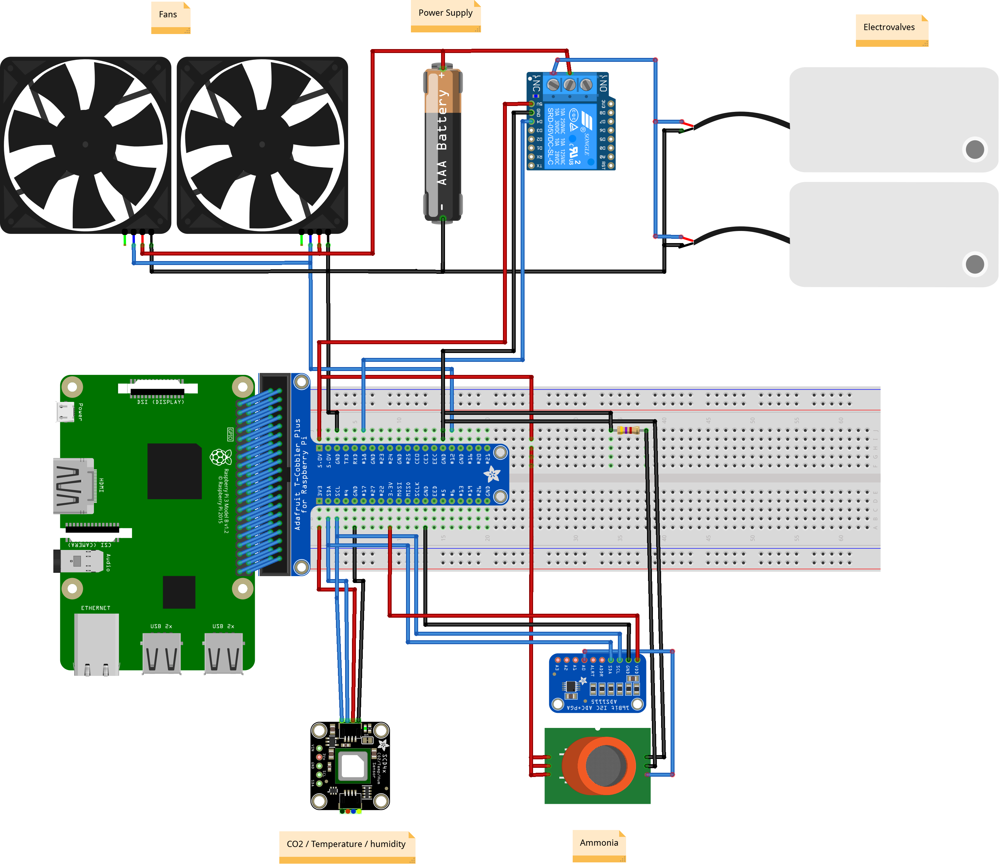
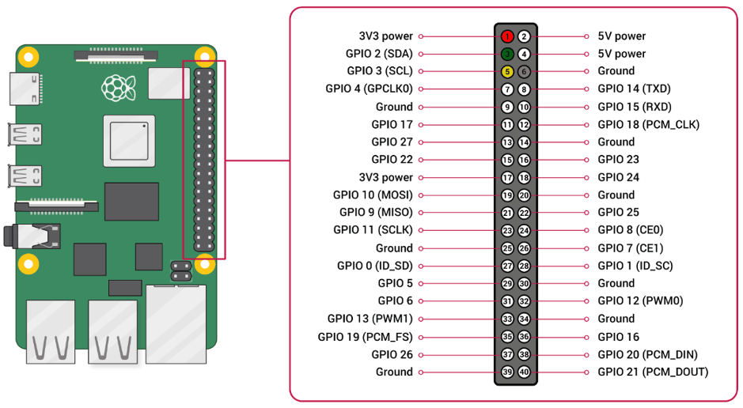
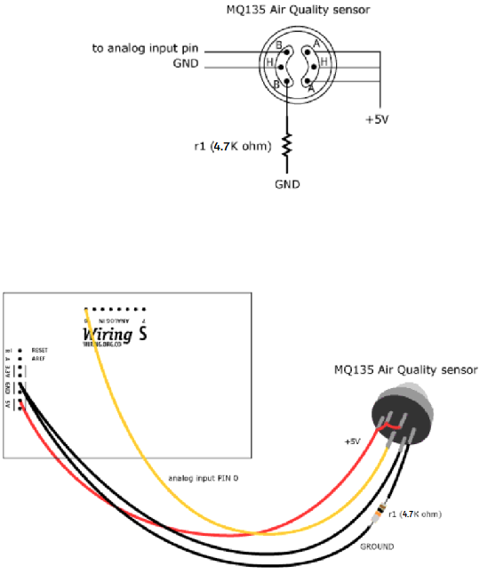
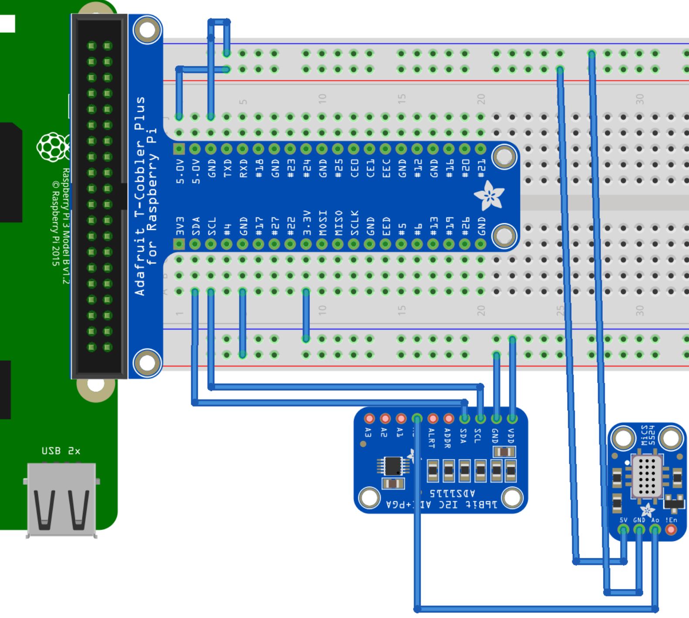
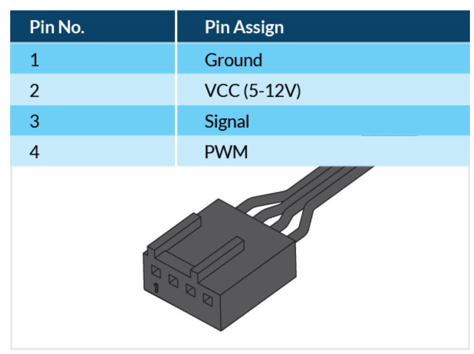
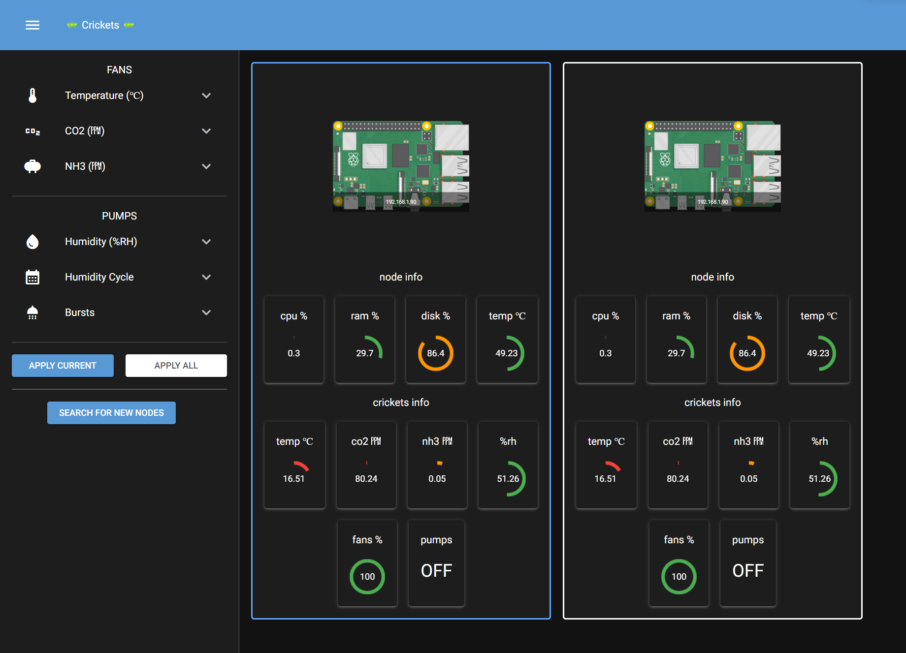
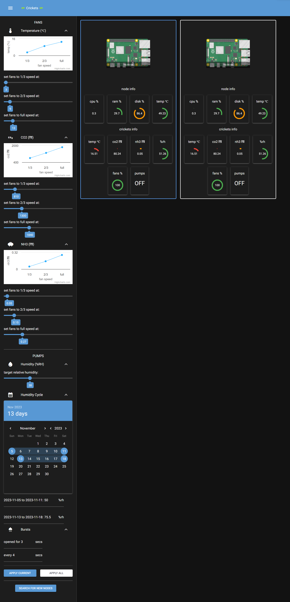

# Cricket Environmental Control
Hardware and Software for a Proof of Concept cricket environmental control system

# Hardware
Electronics schematics

## Parts
For each node in the system:
- x1 [Raspberry Pi 3/4](https://www.raspberrypi.com/products/raspberry-pi-4-model-b/)
- x1 NH³ Sensor ([MQ-137](https://www.sparkfun.com/products/17053))
- x1 CO²/Humidity/Temperature Sensor ([SCD40-D-R2](https://eu.mouser.com/ProductDetail/Seeed-Studio/101020952?qs=Wj%2FVkw3K%252BMAxvvk3MfR8Aw%3D%3D))
- x9 Pump, 12v DC, Normally Cosed
- x9 FAN, 4 PIN ,PWA
- x1 Power Supply
- x1 [Raspberry Pi GPIO T-Cobbler](https://mauser.pt/catalog/product_info.php?cPath=1667_2620_2955&products_id=096-7339)
- x1 Analogue-Digital Signal Converter ([ADS 1115](https://mauser.pt/catalog/product_info.php?cPath=1667_2604_3365&products_id=096-7616))
- x1 1-Channel Relay
- x1 4.7KΩ resistor

## How to Build
Raspberry Pi pins layout, for reference

### MQ137
Connect the pins as shown in the first figure. Red for 5V, black for ground, yellow for signal. Don't forget the 4.7KΩ resistor.

(the mics5524 in the diagram is a placeholder for MQ137)

| SCD40  | Raspberry Pi | ADS 1115 |
|--------|--------------|----------|
|   5V   |   5v Power   |          |
| Ground |    Ground    |          |
| Signal |              |    A0    |
|        |      SDA     |    SDA   |
|        |      SCL     |    SCL   |
|        |    Ground    |  Ground  |
|        |   3v Power   |    VDD   |

### SCD40
Make the following connections

| MQ137 | Raspberry Pi |
|-------|--------------|
|  VCC  |   3v Power   |
|  GND  |    Ground    |
|  SDA  |      SDA     |
|  SCL  |      SCL     |

### Fans
Typical PWA Fan connector

- Connect the VCC wire of each fan to the 12V power supply's positive terminal
- Connect all the GND wires of the fans to the 12V power supply's negative terminal and also to the Raspberry Pi's ground (GND) pin
- Connect the PWM wire of each fan to the GPIO12 pin on the Raspberry Pi

|  Fan  | Raspberry Pi | Power Supply |
|-------|--------------|--------------|
|  VCC  |              | 12v (yellow) |
|  GND  |    Ground    |Ground (black)|
|  PWM  |    GPIO 12   |              |

### Pumps

Step 1: Connect the power supply to the relay module
- Connect the positive terminal of the power supply to the COM pin on the relay module
- Connect the negative terminal of the power supply to the negative terminal of each valve

Step 2: Connect the relay module to the Raspberry Pi
- Connect one of the relay module's control pins (IN1/SIG1 or IN2/SIG2) to the GPIO 18 pin on the Raspberry Pi
- Connect the GND pin on the relay module to any available ground pin on the Raspberry Pi
- Connect the VCC pin on the relay module to 5V pin on Raspberry Pi

Step 3: Connect the devices to the relay module
- Connect the positive terminal of all valves to the relay module's NC (normally closed) terminal

# Sofware

## Configure Raspberry Pi
1. Flash **Raspberry Pi OS** onto the Raspberry Pi **micro SD card**
2. Insert the micro SD card into the Raspberry Pi
3. Connect the Raspberry Pi to a computer screen, turn it on and follow the on-screen instructions to configure the OS
    1. Connect to WI-FI
4. Extra configurations
    1. Run, in a terminal, `sudo raspi-config`
    2. Select option 3, `Interface options`
    3. Select option I5, `I2C`, and select `yes`
    4. Reboot the PI
5. Clone the github repository into `~/cricket-environmental-control`
6. Run `sudo ./setup.sh` inside the project folder
7. Access frontend at url [localhost:8080](http://localhost:8080) or through <raspberry-pi-ip>:8080

## Frontend
The system control panel looks like this:

In the left the panel are the settings, which can be expanded. 
There are 2 buttons to apply changes made to the settings:
- `Apply Current`, applies settings to the current connected Rasperry Pi
- `Apply All`, applies settings to all Raspberry Pis in the network (including the current connected Raspberry Pi)

At the bottom, there's a `Search for new Nodes` button, which searches the local network for other Raspberry Pis running this software.
If any new Raspberry Pi is found, it shows up in the right panel. The blue border represents the currently connected Raspberry Pi, while the white border represents remote Raspberry Pis in the same local network.

Relevant information is shown for each Raspberry Pi. Host information (node info):
- CPU usage
- RAM usage
- Disk usage
- CPU Temperature

Crickets enviroment information:
- Environment Temperature (°C)
- CO² concentration (ppm)
- NH³ concentration (ppm)
- Relative Humidity (%)
- Fans speed (%)
- Pumps state (ON/OFF)

The circles update in real time and show a `green`/`orange`/`red` color to indicate if the value is ok or not.

More settings panel details. If all settings menu are expanded, we get this:

Crickets environment `temperature`, `CO²` concentration and `NH³` concentration affect the speed of the `fans`.
All 3 settings are divided into 3 levels, each one defining at which speed the fans should run if the temperature/CO²/NH³ reach that value.
The highest fan speed prevails

The `humidity` affects when the `pumps` open or close.
A target humidity can be defined which will trigger the pumps if the humidity gets below that threshold.
While the humidity is below the threshold, the pumps switch between the ON and OFF state at a rate defined by the Burst options.
The pumps will stay ON for X seconds every Y seconds, as defined by the settings.

Lastly, cycles can be defined using the Humidity Cycle calendar.
A cycle is a period where the target relative humidity will increase/decrease linearly from the current set target until the target defined for that cycle.

For example:
- The current target is set at 23%RH
- Set a cycle between 2023-10-18 and 2023-11-18 with a new target of 50%RH
- When we enter the first day of the cycle, 2023-10-18, the target relative humidity will automatically increase linearly
- Every 12h the target relative humidity gets updated to a new value closer to the new target
- At the end of the cycle, the automatic update stops